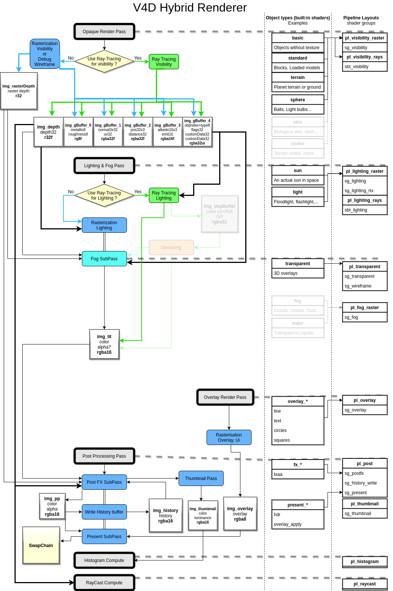

# v4d_project

Vulkan4D **DEV STATUS** : `in active development` *(Not ready for public use just yet)*

☑️ CMAKE cross-platform build system from linux host  
☑️ Core helpers  
☑️ Core IO utilities  
☑️ Core Config utilities  
☑️ Core Multithreading utilities  
☑️ Core Cryptographic utilities  
☑️ Core Data Streaming utilities  
☑️ Core Networking utilities  
☑️ Mudular structure  
☑️ Sample Module and documentation  
☑️ Core Graphics utilities (Vulkan API)  
☑️ Hybrid Ray-Tracing Renderer module  
☑️ Physics Module (Bullet3)  
☑️ Multiplayer/Networking utilities  
⚙️ Demo game (Galaxy4D)  
⬜ In-game coding framework (XenonCode)  
⬜ Audio system  
⬜ Launcher template  
⬜ Build system for Visual Studio on Windows host  
⬜ LTBL (Let-There-Be-Light) Fully path-traced renderer  
⬜ Complete Engine documentation  
⬜ Editor Tools  
⬜ Licensing  

Here's the Discord Server for Vulkan4D related discussions : 
https://discord.gg/5aY3ZBW

----

## What is Vulkan4D ?

**Vulkan4D** is a game engine meant for large scale open worlds with high fidelity graphics. 

* Pure C++17 game engine (C++20 coming soon)
* Build games for 64-bit Windows and Linux platforms with dedicated GPU
* Developed from the ground up for optimal use of the Vulkan API and Ray-Tracing
* Specialized for completely dynamic or procedural worlds with user-created content
* Fully Modular and supports Modding out of the box

----

## Renderer

V4D games will allow for up to three modes of rendering : 
- **Basic** : basic rasterization without shadows nor reflections
- **Hybrid** : rasterizaton with ray-traced shadows, reflections and GI
- **Let There Be Light** : 100% Path-Traced with photorealistic graphics

----

## Is Vulkan4D a good choice for your project ?

You **may** use V4D if one of these apply to your project : 

* You are making a realistic space game with full size planets
* You are making a large scale open-world MMO
* You want high fidelity graphics with Ray-Tracing
* You need double precision physics
* You want your game to support Modding
* Your game world is very dynamic and cannot afford having baked lighting/assets

You **should NOT** use V4D if one of these apply to your project : 

* You are making a game for Consoles or Mobile devices
* You want MAC/OSX or 32-bit support
* You are making a game that can run on integrated graphics
* You are/have level designers who need to drag and drop assets in a scene
* You are making a 2D or 2.5D game

----

### Requirements for development

* Vulkan capable dedicated GPU and driver
* Linux 64-bit system with `gcc` 9.3+ (Manjaro works great)

*Support for Windows 10 & MSVC **coming soon***

*Support for MAC/OSX or 32-bit OS is **not** planned*

----

### Requirements for playing / testing

* 64-bit **Windows 10** or **Linux**
* Vulkan capable dedicated GPU with at least 4 gb or VRAM
* Recent GPU drivers with Vulkan 1.1+ support
* CPU with at least 4 cores
* At least 8 gb or system RAM

*We are **NOT** planning to support MAC/OSX, Mobile, Consoles or 32-bit OS*

*However, we plan to support streaming in the future for other platforms*

----

## The WHY

Most (if not all) current game engines are optimized for fixed-map games with limited scale where level designers place assets in a scene using an editor, and very often rely on pre-baked graphics. 

This means that other game engines are not meant for Large-scale Procedural Dynamic Open-World games with lots of user-created contents. 

But that is where Vulkan4D shines !

Vulkan4D is also designed especially for realistic large scale space games/simulators. 

----

## Key Features

* Vulkan Renderer with full Ray Tracing support
* Double precision physics system
* Flexible Modular system
* Advanced data streaming utilities
* Advanced Multiplayer integration utilities
* In-game coding framework

----

## Our five commandments
As a developer for this project or for a resulting game, you will respect our 5 Commandments. 

1. **Thou shall obey physics** 
	*We will not sacrifice nor compromise realism for arcade-style gameplays.*
2. **Thou shall not see "Loading"** 
	*Immersive, seamless transitions, no loading screens, EVER.*
3. **Thou shall not see a skybox** 
	*Actual clouds, stars, planets, etc. are rendered.*
4. **Thou shall be within thy self** 
	*Focused on fully immersive, first person view.*
5. **Thou shall not hit invisible walls** 
	*What you can see, you can touch !*

----

## Building Vulkan4D library or project
(Only supported on **Linux 64-bit** at the moment)

### Dependencies
* `openssl` >= 1.1.0 (and `libssl-dev` package on debian systems)
* `glslang` >= 8.13
* `gcc` >= 9.3
* `cmake` >= 3.10

### Download V4D and First Build

```bash
# from project parent directory
git clone --recursive git@github.com:Vulkan4D/v4d_project.git
cd v4d_project
tools/cleanbuild.sh
```
Unit tests will run after the build

You may want to make it your own git repository

```bash
# from project directory
tools/initNewGitRepository.sh
git remote add origin <Your Repository Url>
git push -u -f origin master
```

----

## Project Structure

A Vulkan4D Project consists of the following directory structure : 

* `.vscode` optional project settings for the Visual-Studio-Code IDE
* `build/` created automatically to contain generated/build files
* `crosscompile` your optional cross-compilation scripts
* **`res/`** optional directory to contain project resources
* **`src/`** contains ALL source files
* `tmp/` optional temporary directory
* `tools/` optional submodule containing useful V4D tools - **DO NOT EDIT**
* **`workspace/`** optional directory containing your workspace and tools
* `.editorconfig` optional project settings for general IDEs / GitHub
* `.git` , `.gitignore` , `.gitmodules` git configuration files
* `CMakeLists.txt` Project/V4D Builder Template
* `README.md` this documentation file

The `src` directory will contain all source files, libraries, compiled resources and modules used for your project. It consists of the following structure in addition to your own libraries and source files : 

* `openssl/` V4D depends on the OpenSSL library >= 1.1.0
* `v4d/` contains everything related to the V4D Engine, including your own modules
	* `./core/` submodule for the Core of V4D - **DO NOT EDIT ANYTHING IN CORE**
	* **`./modules/`** You may remove unneeded modules or add your own mods here
	* `./xvk/` Vulkan dynamic loader - V4D depends on it - **DO NOT EDIT XVK**
	* **`./v4dconfig.hh`** You may edit macros here for compiling a custom v4d.dll
* **`config.hh`** You may edit/add macros here for your own project configuration
* **`main.cpp`, `*.cpp`** Source code for your app/game
* **`settings.hh`** Defines the structure of a settings.ini configuration file
* **`tests.cxx`** Your unit tests

Files/Directories that you will typically write your code in are in **bold**. 

----

## V4D Modules (modding system)

Vulkan4D is modular and built from the ground up to fully support Modding. 

A module may contain resources and shared libraries that are loaded at runtime into the application.

See modding documentation in [the sample module repository](https://github.com/Vulkan4D/v4d_module_sample)

----

## License

Not yet determined. 

V4D is most likely going to be Open-source, with limited commercial use. 
Developers/companies that contribute to its development may get a free/reduced price license for commercial use depending on the scale and usability of their contribution. 

----
----

# Diagrams


